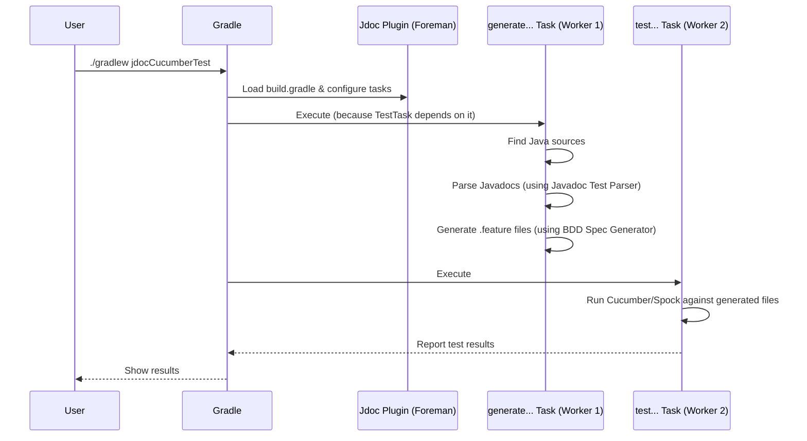

# Chapter 1: Gradle Build Integration

Welcome to the `jdoc-test` tutorial! Ever wished you could write simple tests directly inside your Java code comments (Javadocs) and have them run automatically when you build your project? That's exactly what `jdoc-test` helps you do!

This first chapter introduces the magic behind making this automation happen: **Gradle Build Integration**.

## The Problem: Manual Test Running is Tedious

Imagine you've written some neat examples or test cases right in your Javadoc comments. How would you actually run them?

1.  You'd need to somehow *read* those comments from your Java files.
2.  Then, you'd need to *convert* those comments into actual test files that a testing tool (like Spock or Cucumber) can understand (e.g., `.groovy` or `.feature` files).
3.  If needed (like for Spock), you'd have to *compile* these generated test files.
4.  Finally, you'd need to *run* these tests using the appropriate testing tool.

Doing this manually for every change would be repetitive and error-prone. We need a way to automate this whole process!

## The Solution: Gradle Plugins as Your Build Foreman

This is where Gradle and the `jdoc-test` Gradle plugins come in. Think of Gradle as a powerful tool that builds your software project, like a recipe for making your application. Gradle plugins are like adding extra steps or specialized tools to that recipe.

The `jdoc-test` project provides two specific Gradle plugins:

1.  `jdoc-spock-gradle-plugin`: For tests written in a Spock-like syntax within Javadocs.
2.  `jdoc-cucumber-gradle-plugin`: For tests written in a Gherkin/Cucumber-like syntax within Javadocs.

These plugins act like a **construction foreman** for your Javadoc tests. The foreman (the Gradle plugin) knows exactly how to manage the process:

*   It reads the plans (your Java source files with Javadoc tests).
*   It coordinates workers (Gradle tasks) to prepare the materials (generate `.groovy` or `.feature` test files).
*   It ensures the final structure is built and checked (compiles and runs the tests).
*   It even brings the necessary tools and materials (manages dependencies for Spock or Cucumber).

By using these plugins, the entire process of parsing, generating, compiling (if needed), and running your Javadoc tests becomes a seamless part of your regular Gradle build.

## How to Use It: Applying the Plugin

Let's see how simple it is to add this automation using the Cucumber plugin as an example. You just need to tell Gradle to use the plugin in your `build.gradle` (if using Groovy DSL) or `build.gradle.kts` (if using Kotlin DSL) file.

**Example: Applying the Cucumber Plugin (build.gradle - Groovy DSL)**

```groovy
plugins {
  id 'java' // Your project needs the Java plugin
  id 'io.github.boolivar.jdoctest.jdoc-cucumber' // Apply the jdoc-test Cucumber plugin
}

// Optional: Configure the plugin if defaults aren't right
// jdocCucumber {
//   cucumberVersion = "7.15.0" // Specify Cucumber version if needed
//   // Other configurations possible, but defaults often work!
// }

repositories {
  mavenCentral() // Needed to download the plugin and dependencies
}

// The plugin automatically adds dependencies like cucumber-java
// You might need glue packages for Cucumber step definitions
// dependencies {
//   testImplementation 'io.cucumber:cucumber-java:...' // Managed by plugin
//   testImplementation 'your.glue.code.package:...'
// }
```

**Explanation:**

1.  `plugins { ... }`: This block tells Gradle which plugins to activate for your project.
2.  `id 'java'`: We assume you have a standard Java project.
3.  `id 'io.github.boolivar.jdoctest.jdoc-cucumber'`: This is the key line! It applies the `jdoc-test` Cucumber plugin.
4.  `repositories { ... }`: Tells Gradle where to find the plugin code.
5.  `jdocCucumber { ... }` (Optional): Allows you to customize plugin settings, but often the defaults are fine to start. The plugin automatically figures out where your Java source code is and where to put generated files. It also adds the necessary Cucumber dependency for you!

That's it! By adding that one line (`id '...'`), you've enabled the magic.

## What Happens Now? New Gradle Tasks!

Once you apply the plugin, it automatically adds new tasks to your Gradle project. For the Cucumber plugin, the main tasks are:

*   `generateCucumberFeatures`: This task reads your Javadocs and generates the `.feature` files.
*   `jdocCucumberTest`: This task runs the generated `.feature` files using Cucumber. It automatically depends on `generateCucumberFeatures`, so you usually just run this one.

You can run these tasks from your command line:

```bash
# Generate the .feature files only
./gradlew generateCucumberFeatures

# Generate the .feature files AND run them
./gradlew jdocCucumberTest

# Often, running the standard 'check' or 'test' task will also trigger jdocCucumberTest
./gradlew check
```

Similarly, the Spock plugin (`id 'io.github.boolivar.jdoctest.jdoc-spock'`) adds tasks like `generateSpockSpecs`, `compileJdocSpockGroovy`, and `jdocSpockTest`.

## How It Works Under the Hood: The Foreman and the Workers

Let's peek behind the curtain. How does applying the plugin actually set everything up?

1.  **Configuration Phase:** When Gradle starts and reads your `build.gradle` file, it sees the `jdoc-test` plugin ID.
    *   The plugin code (like `JdocCucumberPlugin.java` or `JdocSpockPlugin.java`) runs.
    *   It tells Gradle about the new tasks (`generate...`, `test...`).
    *   It configures these tasks:
        *   Where to find your Java source code (`sources`).
        *   Where to put the generated test files (`outputDir`).
        *   What dependencies are needed (like `cucumber-java` or `spock-core`).
        *   Task dependencies (e.g., `jdocCucumberTest` must run *after* `generateCucumberFeatures`).

2.  **Execution Phase:** When you run a task like `./gradlew jdocCucumberTest`:
    *   Gradle figures out the task dependencies. It sees `jdocCucumberTest` depends on `generateCucumberFeatures`, so it runs `generateCucumberFeatures` first.
    *   **`generateCucumberFeatures` Task Runs:**
        *   This task (defined in `JdocCucumberTask.java`) gets the list of Java source files.
        *   Internally, it uses the [Javadoc Test Parser](02_javadoc_test_parser_.md) to read and understand the special Javadoc comments.
        *   It then uses the [BDD Spec Generator](03_bdd_spec_generator_.md) to create the actual `.feature` files in the specified output directory (usually somewhere in `build/generated/sources/...`).
    *   **(For Spock only) `compileJdocSpockGroovy` Task Runs:** If you were using the Spock plugin, a task would run here to compile the generated `.groovy` spec files into Java bytecode.
    *   **`jdocCucumberTest` Task Runs:**
        *   This task (configured in `JdocCucumberPlugin.java` to be a `JavaExec` task for Cucumber, or a `Test` task for Spock) executes the testing framework.
        *   For Cucumber, it runs the Cucumber CLI, pointing it to the generated `.feature` files and your step definition code ("glue").
        *   For Spock, it runs the JUnit Platform test runner, telling it to look for tests in the compiled output of the generated specs.
        *   The test results are reported just like any other tests in your build.

Here's a simplified diagram showing the flow when you run the test task:



## A Glimpse at the Plugin Code

You don't *need* to understand the plugin's internal code to use it, but seeing a small piece can help clarify what's happening.

**Example: Part of `JdocCucumberPlugin.java`**

```java
// Inside the JdocCucumberPlugin class...

@Override
public void apply(Project project) {
    // Create extension for configuration (like setting cucumberVersion)
    JdocCucumberExtension extension = project.getExtensions()
            .create("jdocCucumber", JdocCucumberExtension.class);

    project.getPlugins().withType(JavaPlugin.class, javaPlugin -> {
        // Configure defaults (source dirs, output dir, etc.)
        configureExtension(project, extension);

        // Add Cucumber dependency automatically
        project.getDependencies().addProvider(/* ... */);

        // IMPORTANT: Register the task that generates .feature files
        project.getTasks().register(GENERATE_FEATURES_TASK_NAME, JdocCucumberTask.class,
            task -> configureCucumberTask(task, extension)); // Sets input/output dirs

        // IMPORTANT: Register the task that runs the tests
        project.getTasks().register(TEST_TASK_NAME, JavaExec.class,
            task -> configureTestTask(task, extension)); // Sets up Cucumber CLI run
    });
}

// Helper method to configure the generation task
private void configureCucumberTask(JdocCucumberTask task, JdocCucumberExtension extension) {
    task.setGroup(TASK_GROUP); // Group task in ./gradlew tasks output
    task.dependsOn(/* compileJava task */); // Ensure code is compiled first
    task.getOutputDir().set(extension.getOutputDir()); // Tell task where to write files
    task.getSources().set(extension.getSources()); // Tell task where to find Java files
    // ... other settings ...
}
```

**Explanation:**

*   The `apply` method is called by Gradle when the plugin is activated.
*   It uses `project.getTasks().register(...)` to tell Gradle about the new tasks (`generateCucumberFeatures`, `jdocCucumberTest`).
*   It links these tasks to specific Java classes (`JdocCucumberTask.java`, `JavaExec`) that contain the logic for *what* the task does.
*   Helper methods like `configureCucumberTask` set up the task's inputs (like source files) and outputs (like the generated features directory) and dependencies (`dependsOn`).

This registration and configuration are how the plugin integrates the Javadoc testing process seamlessly into the Gradle build lifecycle.

## Conclusion

You've now seen how `jdoc-test` uses Gradle plugins (`jdoc-spock-gradle-plugin` and `jdoc-cucumber-gradle-plugin`) to act as a "foreman," automating the entire process of turning your Javadoc tests into runnable specifications. By simply applying the plugin in your `build.gradle` file, you get:

*   Automatic discovery of Javadoc tests.
*   Generation of `.groovy` (Spock) or `.feature` (Cucumber) files.
*   Compilation of generated tests (for Spock).
*   Integration with standard Gradle test execution tasks.
*   Management of necessary testing framework dependencies.

This automation makes writing and running tests directly in your Javadocs incredibly convenient.

But how does `jdoc-test` actually understand the tests written inside the `/** ... */` comments? That's the job of the parser. In the next chapter, we'll dive into the details of the [Javadoc Test Parser](02_javadoc_test_parser_.md).

---

Generated by [AI Codebase Knowledge Builder](https://github.com/The-Pocket/Tutorial-Codebase-Knowledge)