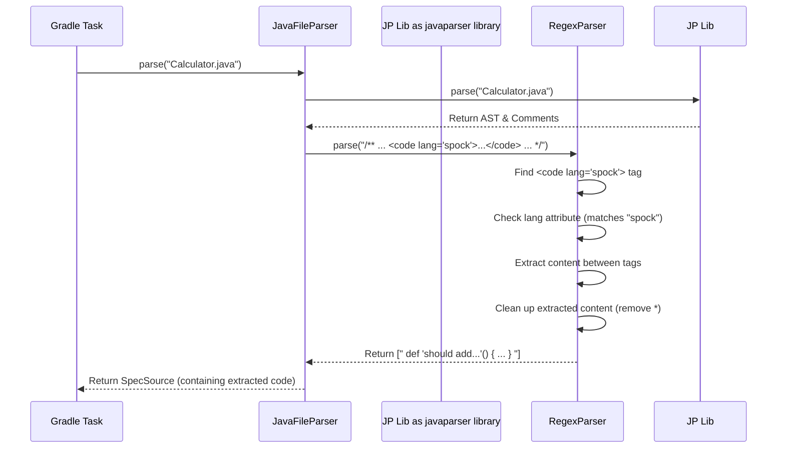

# Chapter 2: Javadoc Test Parser

In the [previous chapter](01_gradle_build_integration_.md), we saw how the `jdoc-test` Gradle plugins act like a foreman, automating the process of running tests embedded in Javadocs. But how does the foreman actually *find* the instructions (the test code) written inside those comments? It needs a specialized tool to read and understand them.

## The Problem: Finding Needles in a Haystack

Imagine your Java code is like a big library full of books (your `.java` files). Your Javadoc comments are like notes written inside these books. Some of these notes are just explanations, while others contain special instructions – your tests!

How can we automatically find *only* the test instructions and ignore the rest? We need a way to tell our tool: "Search through all these Java files, look inside the Javadoc comments (`/** ... */`), and only pull out the parts marked as tests."

## The Solution: The Javadoc Test Parser - Your Code Librarian

This is where the **Javadoc Test Parser** comes in. Think of it as a meticulous librarian specifically trained to find test code within your Javadocs.

*   **Its Goal:** Scan Java source files and extract code snippets marked with special tags.
*   **The Special Tag:** It looks for HTML-like tags: `<code lang="...">`. The `lang` attribute tells the parser what *kind* of code it is (e.g., `lang="spock"` or `lang="gherkin"`).
*   **The Process:**
    1.  The parser reads a Java file.
    2.  It finds all Javadoc comments (`/** ... */`).
    3.  Inside each comment, it searches for `<code lang="...">` tags.
    4.  If a tag's `lang` matches what it's looking for (like "spock"), it carefully copies the text *between* the opening `<code ...>` and the closing `</code>`.
    5.  This extracted text (your test code) is then collected.

This extracted code is the raw material that will later be turned into actual runnable tests.

## How It Works: An Example

Let's look at a simple Java class with a Javadoc test:

**`Calculator.java`**

```java
package com.example;

/**
 * A simple calculator.
 *
 * <pre><code lang="spock"> // <-- The parser looks for this tag!
 * def "should add two numbers"() {
 *   given:
 *     def calc = new Calculator()
 *   when:
 *     def result = calc.add(2, 3)
 *   then:
 *     result == 5
 * }
 * </code></pre> // <-- And extracts content until here
 */
public class Calculator {
    /**
     * Adds two integers.
     * @param a the first number
     * @param b the second number
     * @return the sum
     */
    public int add(int a, int b) {
        return a + b;
    }

    // Another method without Javadoc tests...
    public int subtract(int a, int b) {
        return a - b;
    }
}
```

Now, let's imagine the Javadoc Test Parser (configured to look for `lang="spock"`) processes this file.

**Input:** `Calculator.java` (the file content above)

**Processing:**
1.  The parser finds the main Javadoc comment for the `Calculator` class.
2.  Inside, it spots `<code lang="spock">`. Since `lang` matches "spock", it gets interested.
3.  It extracts everything between `<code ...>` and `</code>`.
4.  It might do a little cleanup, like removing the leading `* ` often found on Javadoc lines.

**Output:** A list containing one string:

```groovy
// This is the extracted string (example)
"""
 def "should add two numbers"() {
   given:
     def calc = new Calculator()
   when:
     def result = calc.add(2, 3)
   then:
     result == 5
 }
"""
```

This extracted string is exactly the Spock test code we wrote in the comment! The parser ignored the regular Javadoc text and the `add` method's Javadoc because they didn't have the special `<code lang="spock">` tag.

## Under the Hood: The Parsing Machinery

How does the parser actually achieve this? It uses a couple of key components working together:

1.  **`JavaFileParser`:** This component is responsible for opening and reading the `.java` file. It uses a standard Java parsing library (like `javaparser-core`) to understand the structure of the Java code and, importantly, to identify all the comments (both `/** Javadoc */` and `/* block */` comments).
2.  **`JdocParser` (specifically `RegexParser`):** Once `JavaFileParser` finds a comment, it passes the *text content* of that comment to a `JdocParser`. The `RegexParser` implementation uses Regular Expressions (powerful text-searching patterns) to find the specific `<code lang="...">...</code>` structures within the comment text. It checks if the `lang` attribute matches the desired language (e.g., "spock"). If it finds a match, it extracts the content.

Let's look at a simplified view of the code involved:

**Core Interface (`JdocParser.java`):**

```java
package org.bool.jdoc.core;

import java.util.List;

// Defines the basic contract: take comment text, return code blocks
public interface JdocParser {
    List<String> parse(String content);
}
```

This simple interface just says: "Give me some text (the comment content), and I'll give you back a list of code strings I found inside."

**The File Reader (`JavaFileParser.java` - Simplified):**

```java
package org.bool.jdoc.core;

// ... imports ...

public class JavaFileParser {

    private final JavaParser javaParser; // Tool to read Java code structure
    private final JdocParser jdocParser; // Tool to find code in comments

    // Constructor sets up the tools
    public JavaFileParser(String lang) {
        this.javaParser = new JavaParser(/* ... */); // From javaparser library
        this.jdocParser = new RegexParser(lang); // Our regex tool, configured for the language
    }

    // Main method to parse a file
    public SpecSource parse(Path file) {
        // 1. Use javaParser to read the file & find comments
        ParseResult<CompilationUnit> result = javaParser.parse(file);
        // (Error handling omitted for simplicity)
        CompilationUnit unit = result.getResult().get();
        CommentsCollection comments = result.getCommentsCollection().get();

        // 2. Process all found comments
        List<String> allCodeBlocks = comments.getComments().stream()
            // Only look at Javadoc and block comments
            .filter(c -> c instanceof JavadocComment || c instanceof BlockComment)
            // 3. For each comment, use jdocParser to extract code
            .flatMap(comment -> jdocParser.parse(comment.getContent()).stream())
            // Ignore empty results
            .filter(code -> !code.trim().isEmpty())
            .collect(Collectors.toList());

        // Return the findings
        return new SpecSource(unit, allCodeBlocks);
    }
}
```

This shows how `JavaFileParser` orchestrates the process: use `javaParser` to get comments, then loop through them, passing each comment's content to `jdocParser` (our `RegexParser`) to do the detailed searching.

**The Regex Finder (`RegexParser.java` - Conceptual):**

```java
package org.bool.jdoc.core;

// ... imports ...

public class RegexParser implements JdocParser {

    // Pattern to find "<code ...>" or "</code>"
    private static final Pattern CODE_TAGS = Pattern.compile("<code(?: .*?)?>|<\\/code>");
    // Filter to check the lang="..." attribute
    private final Predicate<String> langFilter;

    // Constructor takes a filter for the language
    public RegexParser(String lang) {
        // Creates a filter: does the tag contain 'lang="<lang>"'?
        this.langFilter = Pattern.compile(String.format(" lang *= *\"%s\"", lang))
                                 .asPredicate();
    }

    @Override
    public List<String> parse(String commentContent) {
        List<String> extractedCode = new ArrayList<>();
        // 1. Use CODE_TAGS pattern to find all <code> or </code> tags
        Matcher matcher = CODE_TAGS.matcher(commentContent);
        // (Logic to pair opening/closing tags and check langFilter omitted)
        // ... complex logic using the matcher ...
        // 2. If an opening tag passes the langFilter:
        //    Extract text between opening and closing tag
        //    Clean up text (e.g., remove leading '*')
        //    Add cleaned text to extractedCode list
        // ...
        return extractedCode;
    }

    // Helper to remove leading asterisks from Javadoc lines
    private String removeAsterisks(String content) {
        // ... logic to strip leading "*" ...
        return content; // Simplified for example
    }
}
```

The `RegexParser` uses patterns (`CODE_TAGS`) to find the start and end points of code blocks and applies the `langFilter` to ensure it only extracts blocks for the correct language.

**Simplified Flow Diagram:**

Let's visualize the steps when a Gradle task (like `generateSpockSpecs` from Chapter 1) uses the parser:



This diagram shows the collaboration: The Task asks `JavaFileParser` to parse the file. `JavaFileParser` uses the `javaparser library` to get comments and then asks `RegexParser` to find the relevant code within those comments.

## Conclusion

You've now learned about the **Javadoc Test Parser**, the essential component in `jdoc-test` responsible for finding and extracting your test code from Javadoc comments. It acts like a librarian, scanning your Java files and using the special `<code lang="...">` tag as a bookmark to identify and copy the test snippets you've written.

Key takeaways:

*   The parser looks for `<code lang="...">` tags within Javadoc comments (`/** ... */`).
*   The `lang` attribute (e.g., "spock", "gherkin") tells the parser which code blocks to extract.
*   It uses tools like `JavaFileParser` (to read files and find comments) and `RegexParser` (to find tags and extract content within comments).
*   The output is a list of strings, each containing the raw code found inside a matching tag.

But what happens to this extracted code? Just having the text isn't enough; we need to turn it into actual test files that tools like Spock or Cucumber can run. That's the job of the next component we'll explore.

In the next chapter, we'll see how the [BDD Spec Generator](03_bdd_spec_generator_.md) takes this extracted code and transforms it into runnable `.groovy` or `.feature` files.

---

Generated by [AI Codebase Knowledge Builder](https://github.com/The-Pocket/Tutorial-Codebase-Knowledge)