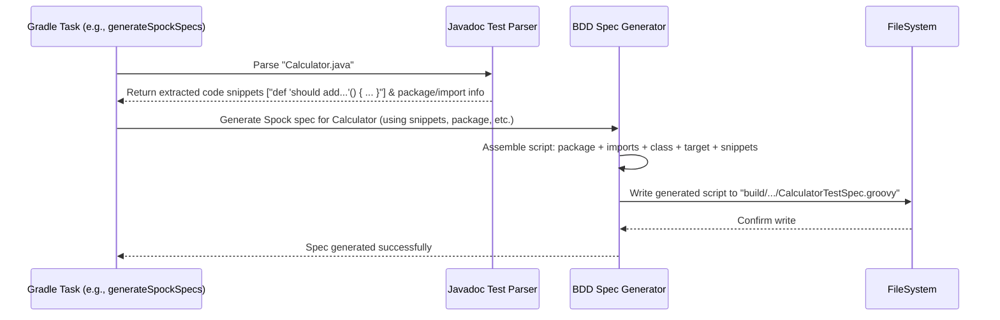

# Chapter 3: BDD Spec Generator

In the [previous chapter](02_javadoc_test_parser_.md), we learned how the [Javadoc Test Parser](02_javadoc_test_parser_.md) acts like a librarian, carefully finding and extracting the raw test code snippets hidden within your Javadoc comments. That's a great start! But there's a small problem: these raw snippets are like actor's notes – they aren't a complete script ready for performance.

## The Problem: Raw Code Snippets Need Formatting

Imagine you have these extracted pieces of test code:

*   For Spock: `def "should add numbers"() { expect: 1 + 1 == 2 }`
*   For Cucumber: `Feature: Addition Scenario: Add two numbers Given I have entered 1 into the calculator And I have entered 1 into the calculator When I press add Then the result should be 2`

Can a testing tool like Spock or Cucumber directly run these text fragments? Not quite.

*   **Spock** needs the code to be inside a proper Groovy class file (`.groovy`) that extends `spock.lang.Specification`. It needs package declarations, imports, and maybe even some setup code to create the object you want to test.
*   **Cucumber** needs the Gherkin text to be saved in a specific file format (`.feature`).

We need something to take these raw notes and format them correctly.

## The Solution: The BDD Spec Generator - Your Test Scriptwriter

This is where the **BDD Spec Generator** comes in. Think of it as a dedicated **scriptwriter** for your tests. Its job is to take the raw code snippets (the "notes") extracted by the parser and turn them into fully formatted, runnable test files (the "script") that Spock or Cucumber can understand.

*   **Input:** The raw test code snippets extracted from Javadocs.
*   **Output:** Properly formatted test files (`.groovy` for Spock, `.feature` for Cucumber).
*   **Process:** Adds necessary boilerplate code, formatting, and structure.

Let's see how this scriptwriter works for both Cucumber and Spock.

## How It Works: Two Different Scripts

The scriptwriter's job depends on which testing framework (actor) the script is for.

### 1. For Cucumber (`.feature` files)

Cucumber's Gherkin syntax is already quite descriptive. The generator's job here is relatively simple.

*   **Input:** A raw Gherkin text block extracted from a Javadoc comment in `Calculator.java`.

```gherkin
Feature: Basic Calculations
  Scenario: Adding two numbers
    Given a calculator
    When I add 2 and 3
    Then the result should be 5
```

*   **Action:** The BDD Spec Generator takes this exact text. It figures out a name for the file, often based on the original Java class name (e.g., `Calculator`) and maybe an index if there are multiple Gherkin blocks (e.g., `Calculator_1.feature`). It then simply writes the raw Gherkin text into that `.feature` file.

*   **Output:** A file named `Calculator_1.feature` (placed in a designated generated sources directory) containing:

```gherkin
Feature: Basic Calculations
  Scenario: Adding two numbers
    Given a calculator
    When I add 2 and 3
    Then the result should be 5
```

That's it! For Cucumber, the generator mostly ensures the extracted text gets saved into the correct file type and location.

### 2. For Spock (`.groovy` files)

Spock tests are written in Groovy and need more structure. The generator has more work to do here.

*   **Input:** A raw Spock code block extracted from a Javadoc comment in `Calculator.java`.

```groovy
def "should add two numbers correctly"() {
  given:
  def calc = new Calculator() // Needs the Calculator class!

  when:
  def result = calc.add(2, 3)

  then:
  result == 5
}
```

*   **Action:** The BDD Spec Generator acts like a smart scriptwriter:
    1.  **Package:** It figures out the package of the original `Calculator.java` file (e.g., `com.example`) and adds a `package com.example;` line.
    2.  **Imports:** It adds standard Spock imports like `import spock.lang.*`. It might also copy imports from the original Java file if needed.
    3.  **Class Definition:** It creates a Groovy class. The class name is usually derived from the original Java class (e.g., `CalculatorTestSpec`) and it must extend `spock.lang.Specification`.
    4.  **Target Object (Optional but common):** It often needs to create an instance of the class being tested (`Calculator`). It might add code like `def $target = new Calculator()` inside the class, making it easy to use in the test snippets. It tries to figure out how to create the object, maybe by looking for a simple constructor.
    5.  **Embedding the Snippet:** It takes the original code snippet and places it *inside* the generated class definition.

*   **Output:** A file named `CalculatorTestSpec.groovy` (placed in a designated generated sources directory) containing something like this:

```groovy
package com.example; // Added by generator

import spock.lang.*; // Added by generator
// Other potential imports might be added here

class CalculatorTestSpec extends Specification { // Added by generator

    // Optional: Generator might create the object under test
    def $target = new Calculator();

    // --- Your original code snippet goes here ---
    def "should add two numbers correctly"() {
      given:
      // Original code might use $target now, or create its own instance
      def calc = $target // Using the generated instance

      when:
      def result = calc.add(2, 3)

      then:
      result == 5
    }
    // --- End of your snippet ---

    // If you had more <code lang="spock"> blocks, they'd go here too

} // Added by generator
```

See how the generator wrapped your raw snippet with all the necessary Groovy and Spock boilerplate? It turned the actor's notes into a complete scene!

## Under the Hood: The Scriptwriting Tools

How does the generator perform this magic? It uses specific helper classes.

*   **For Cucumber:** The process is simpler, often involving classes like `FeatureWriter` (seen in `jdoc-cucumber/src/main/java/org/bool/jdoc/cucumber/FeatureWriter.java`) which primarily handle file I/O – creating directories and writing the extracted Gherkin strings to `.feature` files.

*   **For Spock:** This requires more intelligence. A key component is the `SpockSpecGenerator` class (found in `jdoc-spock-commons/src/main/java/org/bool/jdoc/spock/SpockSpecGenerator.java`).

Let's peek at a highly simplified conceptual version of `SpockSpecGenerator`:

```java
// Simplified concept of SpockSpecGenerator

public class SpockSpecGenerator {

    // Generates the full .groovy file content
    public String generateSpec(String className, String packageName,
                               List<String> importStatements,
                               String targetObjectCreation, // e.g., "new Calculator()"
                               List<String> codeSnippets) {

        StringBuilder script = new StringBuilder();

        // 1. Add package
        script.append("package ").append(packageName).append(";\n\n");

        // 2. Add Spock import
        script.append("import spock.lang.*;\n");
        // Add other imports
        for (String imp : importStatements) {
            script.append(imp).append("\n");
        }
        script.append("\n");

        // 3. Add class definition
        script.append("class ").append(className).append(" extends Specification {\n\n");

        // 4. Add target object field (if provided)
        if (targetObjectCreation != null) {
            script.append("    def $target = ").append(targetObjectCreation).append(";\n\n");
        }

        // 5. Add the extracted code snippets
        for (String snippet : codeSnippets) {
            // Indent the snippet slightly for readability
            script.append("    ").append(snippet.replace("\n", "\n    ")).append("\n\n");
        }

        // 6. Close the class
        script.append("}\n");

        return script.toString();
    }
}
```

This simplified view shows how the generator pieces together the final `.groovy` file string by combining the package, imports, class structure, the optional target object, and the raw code snippets provided by the parser. The actual implementation uses libraries like `javaparser` to get package/import details from the original Java file and reflection to figure out how to create the `$target` object.

**Simplified Flow Diagram:**

Let's imagine the Gradle task `generateSpockSpecs` (from [Chapter 1](01_gradle_build_integration_.md)) using the generator after the parser has done its job.



This shows the handover: The parser extracts the raw materials, and the generator uses those materials to build the final, runnable test file and save it to the file system.

## Conclusion

You've now met the **BDD Spec Generator**, the crucial component that acts as your test scriptwriter. It takes the raw code extracted by the [Javadoc Test Parser](02_javadoc_test_parser_.md) and transforms it into complete, runnable test files.

*   For **Cucumber**, it primarily saves the extracted Gherkin text into `.feature` files.
*   For **Spock**, it does more work, wrapping the extracted Groovy code with package declarations, imports, class definitions (`extends Specification`), and potentially setting up the object under test, saving the result as a `.groovy` file.

Now we have:
1.  Gradle integration to automate the process ([Chapter 1](01_gradle_build_integration_.md)).
2.  A parser to extract test code from Javadocs ([Chapter 2](02_javadoc_test_parser_.md)).
3.  A generator to create runnable test files from that code (This Chapter).

What's the final step? Actually *running* these generated test files! How does `jdoc-test` ensure that tools like JUnit know about these generated tests and execute them?

In the next chapter, we'll explore the [JUnit Test Engine](04_junit_test_engine_.md), which allows standard Java testing tools to discover and run the tests generated by `jdoc-test`.

---

Generated by [AI Codebase Knowledge Builder](https://github.com/The-Pocket/Tutorial-Codebase-Knowledge)