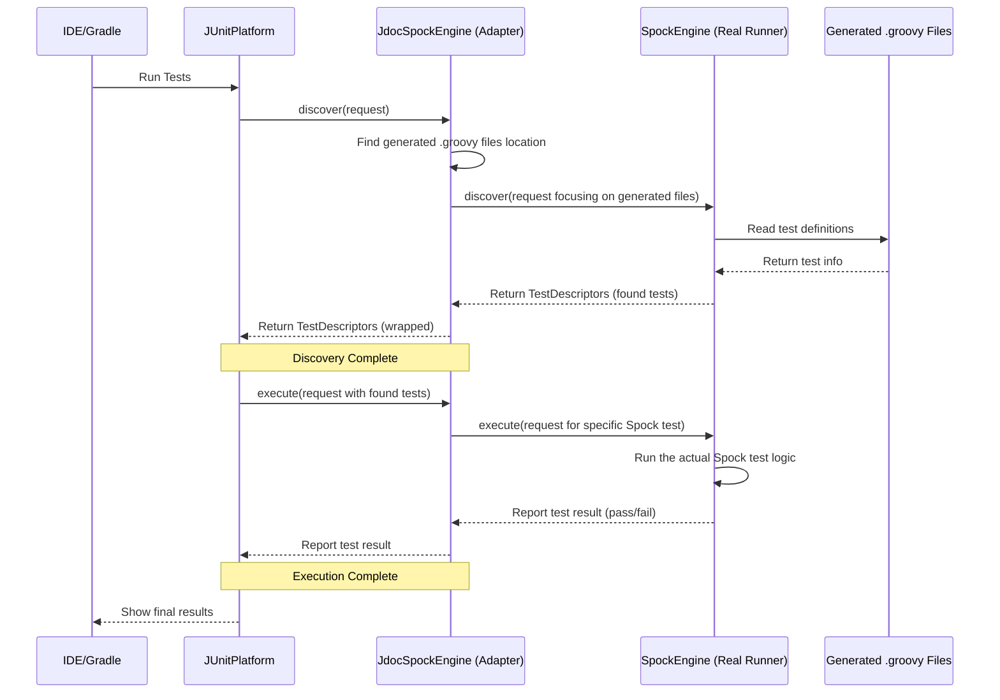

# Chapter 4: JUnit Test Engine

In the [previous chapter](03_bdd_spec_generator_.md), we saw how the [BDD Spec Generator](03_bdd_spec_generator_.md) acts like a scriptwriter, taking the raw test code extracted from your Javadocs and turning it into properly formatted `.groovy` (for Spock) or `.feature` (for Cucumber) files. That's fantastic! Now we have actual test files ready to go.

But how do standard Java testing tools, like your IDE (IntelliJ, Eclipse) or build tools like Gradle, know how to *find* and *run* these generated tests? They usually rely on a standard mechanism called the **JUnit Platform (part of JUnit 5)**.

## The Problem: How Does JUnit Find Our Special Tests?

Imagine you've set up your project using the `jdoc-test` Gradle plugins ([Chapter 1](01_gradle_build_integration_.md)). The build process now automatically uses the [Javadoc Test Parser](02_javadoc_test_parser_.md) and the [BDD Spec Generator](03_bdd_spec_generator_.md) to create test files in a special `build` directory.

Now, you click the "Run Tests" button in your IDE, or you run `./gradlew test`. These tools typically use the JUnit Platform to discover tests. The JUnit Platform asks around: "Hey, are there any tests here I should run?"

It knows how to find standard JUnit tests (`@Test` methods). It might even know how to find standard Spock or Cucumber tests if you have those engines installed directly. But how does it know about *our* tests, the ones generated from Javadocs and sitting in that special `build` folder? It needs someone to tell it where to look and how to run them.

## The Solution: The `jdoc-test` JUnit Test Engine - The Universal Adapter

This is where the `jdoc-test` **JUnit Test Engine** comes into play. It acts like a **universal adapter** for your Javadoc tests.

Think of it this way:
*   **JUnit Platform:** The standard power outlet on the wall (used by IDEs, Gradle, etc.).
*   **Your Javadoc Tests (Generated Files):** A special appliance with a unique plug (the `.groovy` or `.feature` files generated by `jdoc-test`).
*   **`jdoc-test` Test Engine:** The adapter that lets you plug your special appliance into the standard wall outlet.

`jdoc-test` provides two specific engines, which are implementations of the standard JUnit `TestEngine` interface:
1.  `JdocSpockEngine`: Adapts Javadoc-generated Spock tests.
2.  `JdocCucumberEngine`: Adapts Javadoc-generated Cucumber tests.

When the JUnit Platform looks for tests, these `jdoc-test` engines say, "Yes! I know how to find some tests!" They then handle the specifics of locating and running the tests generated from your Javadocs.

## How It Works: Discovery and Delegation

The `jdoc-test` engine doesn't actually run the Spock or Cucumber tests itself. Instead, it acts as a middleman, coordinating with the *real* test engines provided by Spock and Cucumber. Here's the process:

1.  **Discovery Phase:**
    *   The JUnit Platform (triggered by your IDE or Gradle) starts the discovery process. It asks all registered `TestEngine` implementations, including `JdocSpockEngine` or `JdocCucumberEngine`, to find tests.
    *   The `jdoc-test` engine receives this request. It knows (often through configuration provided by the Gradle plugin) where the [BDD Spec Generator](03_bdd_spec_generator_.md) placed the generated test files (`.groovy` or `.feature`).
    *   Crucially, the `jdoc-test` engine *delegates* the actual discovery within those generated files to the *real* engine:
        *   `JdocSpockEngine` tells the standard `SpockEngine` (from Spock framework): "Please discover tests in these specific `.groovy` files."
        *   `JdocCucumberEngine` tells the standard `CucumberTestEngine` (from Cucumber): "Please discover tests in these specific `.feature` files."
    *   The real engine finds the tests (like Spock specifications or Cucumber scenarios) within those files.
    *   The `jdoc-test` engine takes the list of found tests from the real engine, potentially wraps them slightly, and reports them back to the JUnit Platform. Now, JUnit Platform knows about your Javadoc tests!

2.  **Execution Phase:**
    *   After discovery, the JUnit Platform (usually) proceeds to execute the found tests. It tells the `jdoc-test` engine: "Please run these specific tests that you reported earlier."
    *   Again, the `jdoc-test` engine *delegates* the execution:
        *   `JdocSpockEngine` tells the `SpockEngine`: "Please execute these specific Spock tests."
        *   `JdocCucumberEngine` tells the `CucumberTestEngine`: "Please execute these specific Cucumber features/scenarios."
    *   The real engine runs the tests and reports the results (pass, fail, errors).
    *   The `jdoc-test` engine passes these results back to the JUnit Platform, which then displays them in your IDE or build log.

The `jdoc-test` engine acts as a smart adapter, translating the standard JUnit Platform requests into specific instructions for the underlying Spock or Cucumber engines, focused only on the tests generated from Javadocs.

## Under the Hood: Implementing the `TestEngine` Interface

To integrate with the JUnit Platform, `jdoc-test` provides classes like `JdocSpockEngine` and `JdocCucumberEngine` that implement the `org.junit.platform.engine.TestEngine` interface. Let's look at the key parts conceptually.

**The `TestEngine` Interface (Simplified Concept):**

```java
// Simplified view of the JUnit Platform interface
package org.junit.platform.engine;

public interface TestEngine {
    // Unique ID for this engine (e.g., "jdoc-spock")
    String getId();

    // Find tests based on a request (selectors like files, directories)
    TestDescriptor discover(EngineDiscoveryRequest discoveryRequest, UniqueId uniqueId);

    // Run the tests previously discovered
    void execute(ExecutionRequest request);
}
```

Our `JdocSpockEngine` and `JdocCucumberEngine` implement these methods.

**Example: `JdocSpockEngine` (Conceptual Snippets)**

```java
// Inside JdocSpockEngine.java (simplified)
import org.spockframework.runtime.SpockEngine; // The REAL Spock engine
// ... other imports ...

public class JdocSpockEngine implements TestEngine {

    public static final String ID = "jdoc-spock";
    private final SpockEngine realSpockEngine = new SpockEngine(); // Instance of the real engine
    // Helper service to manage discovery/delegation
    private final SpockEngineService spockEngineService = new SpockEngineService(/*...*/);

    @Override
    public String getId() {
        return ID; // Tells JUnit Platform who we are
    }

    @Override
    public TestDescriptor discover(EngineDiscoveryRequest discoveryRequest, UniqueId uniqueId) {
        // 1. Use helper service to find generated .groovy files
        // 2. Ask the REAL SpockEngine to discover tests within those files
        // 3. Return the results wrapped for JUnit Platform
        return spockEngineService.discover(realSpockEngine, discoveryRequest, uniqueId);
        // The spockEngineService internally maps the request, finds generated specs,
        // and asks the realSpockEngine to discover tests in them.
    }

    @Override
    public void execute(ExecutionRequest request) {
        // Execution request contains tests found during discover()
        // The root descriptor comes from our discover() method.
        JdocSpockEngineDescriptor ourRootDescriptor = (JdocSpockEngineDescriptor) request.getRootTestDescriptor();

        // Iterate through the child descriptors (which came from the real SpockEngine)
        for (TestDescriptor spockTestDescriptor : ourRootDescriptor.getChildren()) {
            // Create a new request just for this specific Spock test
            ExecutionRequest spockRequest = ExecutionRequest.create(spockTestDescriptor, /*...*/);
            // 3. Ask the REAL SpockEngine to execute this test
            realSpockEngine.execute(spockRequest);
        }
        // Results are reported back to JUnit Platform via listeners in the request
    }
}
```

**Explanation:**

*   `getId()`: Simply returns the unique name "jdoc-spock".
*   `discover()`: This is where the magic happens. It uses a helper (`spockEngineService`) which figures out where the generated `.groovy` files are (based on the original request and configuration). It then essentially asks the `realSpockEngine` to perform discovery *only* on those files. It gets the `TestDescriptor`s (representing found tests) back from the `realSpockEngine` and returns them (possibly wrapped) to the JUnit Platform.
*   `execute()`: JUnit Platform gives back the descriptors found in the `discover` phase. The `JdocSpockEngine` iterates through the descriptors that originally came from the `realSpockEngine` and tells the `realSpockEngine` to execute each one.

The `JdocCucumberEngine` works very similarly, but it delegates to the `CucumberTestEngine` instead.

**Simplified Flow Diagram (Spock Example):**

This diagram shows how the JUnit Platform interacts with the `JdocSpockEngine`, which then delegates to the real `SpockEngine`.



This diagram illustrates the adapter role: `JdocSpockEngine` receives standard JUnit commands (`discover`, `execute`) and translates them into commands for the `SpockEngine`, specifically targeting the generated files.

## Conclusion

You've now learned about the **JUnit Test Engine** components within `jdoc-test` (`JdocSpockEngine` and `JdocCucumberEngine`). They are the crucial adapters that bridge the gap between the standard JUnit Platform (used by IDEs and build tools) and the tests generated from your Javadoc comments.

Key takeaways:

*   They implement the JUnit 5 `TestEngine` interface.
*   They allow the JUnit Platform to discover and execute tests defined in Javadocs.
*   They work by **delegating** the actual discovery and execution to the *real* Spock (`SpockEngine`) or Cucumber (`CucumberTestEngine`) engines, pointing them to the files created by the [BDD Spec Generator](03_bdd_spec_generator_.md).
*   They act like a **universal adapter**, plugging your special Javadoc tests into the standard testing ecosystem.

This completes the core conceptual journey of `jdoc-test`:
1.  Gradle plugins automate the process ([Gradle Build Integration](01_gradle_build_integration_.md)).
2.  A parser extracts code from comments ([Javadoc Test Parser](02_javadoc_test_parser_.md)).
3.  A generator creates runnable test files ([BDD Spec Generator](03_bdd_spec_generator_.md)).
4.  A test engine integrates these generated tests with JUnit Platform (This Chapter).

With these components working together, you can seamlessly write tests directly in your Javadocs and have them run as part of your standard development workflow!

---

Generated by [AI Codebase Knowledge Builder](https://github.com/The-Pocket/Tutorial-Codebase-Knowledge)