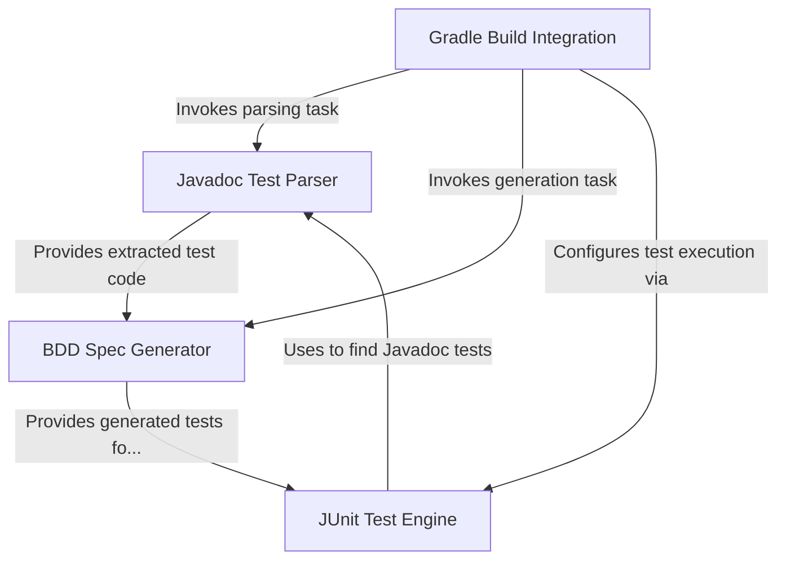

# Tutorial: jdoc-test

`jdoc-test` lets you write *real tests* directly inside your **Javadoc comments**.
It automatically finds these tests (written in formats like Spock or Gherkin), generates the necessary test files (`.groovy` or `.feature`), and allows standard tools like **JUnit** and **Gradle** to discover and run them just like regular tests.
This helps keep your tests *close to the code* they are testing.

**Source Repository:** [jdoc-test](https://github.com/boolivar/jdoc-test)

## Chapters

1. [Gradle Build Integration](01_gradle_build_integration_.md)
2. [Javadoc Test Parser](02_javadoc_test_parser_.md)
3. [BDD Spec Generator](03_bdd_spec_generator_.md)
4. [JUnit Test Engine](04_junit_test_engine_.md)

---

Generated by [AI Codebase Knowledge Builder](https://github.com/The-Pocket/Tutorial-Codebase-Knowledge)